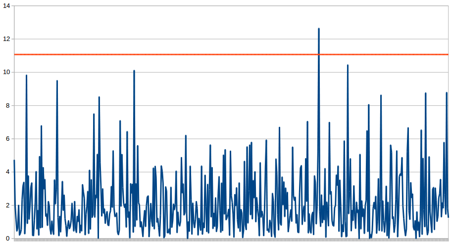
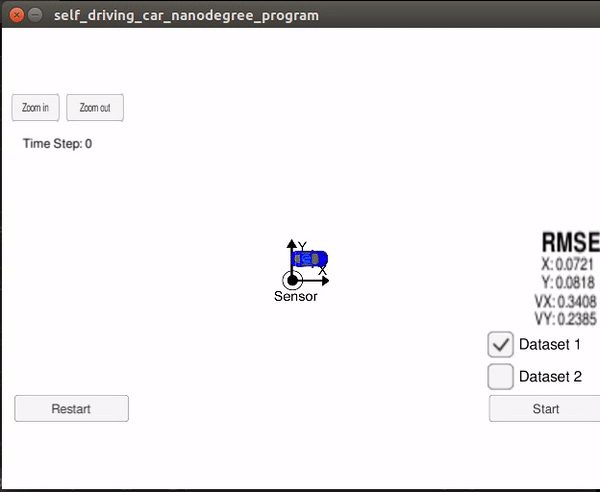
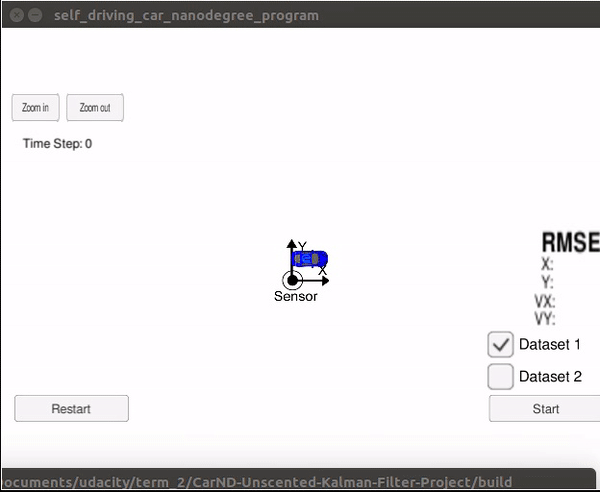
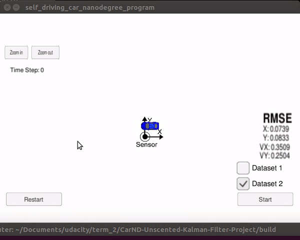

# Unscented Kalman Filter Project

This project explores using an Unscented Kalman Filter to estimate the state of a moving object with noisy lidar and radar measurements. Using sensor fusion to merge incoming data from external sensors and a kalman filter to smooth the measurements from noise we can display the predicted state using the [Udacity Term 2 Simulator](https://github.com/udacity/self-driving-car-sim/releases).

This project assumes that you have already downloaded and installed the Udacity simulator along with all the depenedencies. View the [install.md](https://github.com/djiglesias/CarND-Unscented-Kalman-Filter-Project/blob/master/install.md) to view how to compile this project using cmake and make.

## 1. The UKF Class
The unscented kalman filter provides a nonlinear method for generating a smooth state estimation from one or more noisey sensors such as radar and lidar.

### 1.1 Initialize
Similar to the [Extened Kalman Filter](https://github.com/djiglesias/CarND-Extended-Kalman-Filter-Project) the filter needs to be initialized with data to provide a reference on the starting position with respect to the global frame. The class uses `is_initialized` to track whether a measurement is the first reading, and sets the initial state to the first reading and exits without performing a state prediction or update.

### 1.2 Prediction
Once initialized the filter can begin to work its magic. Upon receiving a new measurement the timestamp of the new data is compared to that of the previous state update and an estimate of the object's position is determined using the last known parameters. 

Augmented sigma points are generated for the predicted position to account for measurement noise in both directions of each degree of freedom. In the UKF class these are stored as the `Xsig_pred_` matrix which represents the predicted state sigma points. This step is independent of which sensor type the class receives in an update.
 
### 1.3 Update
From the predicted object state and known noise an augmented data reading of the incoming sensor type is estimated and compared to the actual data. The two readings are weighted and averaged before updating the current object state.

## 2 Tools Class
The Tools::CalculateRMSE() function takes two vectors, estimation and ground truth, as inputs and returns a vector of RMSE. For every entry in the vector a residual squared sum is totalled and then divided my the length of the vector. This is a parameter used for determining the quality of the algorithm on tracking the models position as it moves.

	$ for (int i=0; i < estimations.size(); i++) {
	$	VectorXd residual = estimations[i] - ground_truth[i];
	$	residual = residual.array()*residual.array();
	$	rmse += residual;
	$ }

## 3. Tuning Parameters
The initial variance values for acceleration and yaw rate were set too high (30 units) which caused the simulation to crash. Using the recommended values from the lessons as a starting point, Normalized Innovations Squared (NIS) provided an indication of whether the system is improving or not. As outlined in the lessons, we are looking for 95% of the error values to be less than 11.070 for an 11 degree of freedom system to be optimally tuned. Setting `std_a_` to 2.0 m/s^2 and `std_yawdd` to 0.4 rad/s^2 results in the following behaviour.

 

## 4. Running the Simulator
### 4.1 Laser Data Only
Running the simulator with only laser data by ignoring data samples that are labelled as "RADAR". The resulting estimate of position and velocity is decent but the accuracy of the values are not enough to satisfy this project with average RMSE for X/Y/VX/VY were 0.1740, 0.1480, 0.5839, 0.2601 respectively.

 

### 4.2 Radar Data Only
Running the simulator with only radar data by ignoring data samples that are labelled as "LASER". The resulting estimate of position and velocity is decent but the accuracy of the values are not enough to satisfy this project with average RMSE for X/Y/VX/VY were 0.2187, 0.3055, 0.4976, 0.3582 respectively.

 

### 4.3 Sensor Fusion (Laser & Radar)
Running the simulator with both radar and laser data results in a much more accurate estimate of position for both position and velocity. The average RMSE for X/Y/VX/VY were 0.0721, 0.0818, 0.3408, 0.2385 respectively which satisfy the requirements for the project (0.09, 0.10, 0.40, 0.30).

 
 

